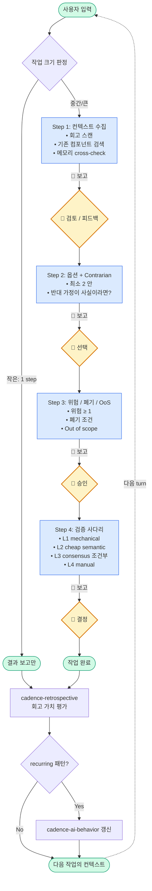

# cadence

> **전체 자동화를 멈추세요. 페이스를 시작하세요.**

AI 가 *한 스텝 산출물* 만 만들고, 개발자가 *다음 스텝* 을 결정한다. 자전거의 cadence, 음악의 cadence — *함께 만드는 리듬* 이 핵심이다.

cadence 는 **AI 협업 사이클을 강제하는 cross-agent skill 패키지**다. Claude Code / OpenAI Codex / GitHub Copilot / Cursor / Windsurf / Cline 등 [20+ AI 도구](https://www.skills.sh/) 에서 *동일 SKILL.md 표준* 으로 작동.

```bash
npx skills add github.com/SWARVY/Cadence
```

[USAGE.md](./USAGE.md) · [철학](#철학-full-ai-driven-의-함정) · [step-gating 사이클](#step-gating-사이클) · [5 skill](#5-skill) · [빠른 시작](#빠른-시작)

---

## 철학: full-ai-driven 의 함정

AI 에게 *"이 기능 만들어줘"* 한 줄을 던지면 — 플랜 / 코딩 / 테스트 / 커밋까지 자동으로 흘러간다. 빠르지만 위험하다:

- **놓친 옵션** — AI 가 *첫 안* 으로 진행. 더 나은 옵션은 영영 묻힘
- **stale 가정** — 회고 / 기존 컴포넌트를 확인 안 한 채 *추상화 결정*
- **mid-PR 회수** — 머지 직전 *spec drift / contract gap* 발견 → 되돌리기 비용 폭증
- **사용자 의견 묻힘** — AI 의 *반사적 동의* (sycophancy) 가 더 나은 안을 차단

cadence 는 *반대 방향* 으로 간다:

| full-ai-driven | cadence (step-gating) |
| --- | --- |
| AI 가 N 단계 자동 진행 | AI 는 *한 스텝 산출물만*, 보고 후 정지 |
| 사용자 = *결과 검수자* | 사용자 = *동료* — 매 스텝 결정 |
| 옵션 1 안 + 자동 실행 | 옵션 2 안 + Contrarian → 선택 → 진행 |
| commit / push 자동 | 명시 요청 시만 — 워크플로우 끝에서 정지 |

> *"AI 가 한 스텝 산출물만 만들고 보고 후 정지. 개발자 피드백 후 다음 스텝."*

## step-gating 사이클



작은 작업은 1 step (게이트 0~1). 중간 2~3 step. 큰 작업만 4 step mandatory. **자동 chain 없음** — 매 게이트가 *개발자의 결정 지점*.

## 5 skill

| skill | 담당 | 적용 시점 |
| --- | --- | --- |
| [using-cadence](./using-cadence/SKILL.md) | **메타 오케스트레이터** — 라우팅 + 우선순위 + step-gating | 매 turn 첫 점검 |
| [cadence-ai-behavior](./cadence-ai-behavior/SKILL.md) | AI 행동 통제 7 룰 — sycophancy / 즉시 편집 / 자동 push 통제 | 모든 AI 응답 turn |
| [cadence-plan](./cadence-plan/SKILL.md) | 플랜 4단 mandatory + 스펙시트 메타-구조 + 검증 사다리 | plan 모드, 신규 spec, 모호 작업, 추상화 결정 |
| [cadence-retrospective](./cadence-retrospective/SKILL.md) | 회고 + 트랜스크립트 마이닝 + 룰화 승급 | 작업 완료 / 실패 / mid-PR 학습 / 룰 위반 발견 |

cadence 는 **cross-stack 범용 협업 워크플로우** 만 담는다. *언어 / 프레임워크 / stack 특화 룰* (TypeScript / React / Python / Go 등) 은 *별도 skill repo* 로 분리하여 fork 자가 자기 stack 만 install.

**작업 사이클 루프**:

```
cadence-plan (진입)  →  실행  →  cadence-retrospective (학습)
       ↑                                       │
       └─── 룰화 승급 → cadence-ai-behavior ←──┘
```

`using-cadence` 가 [obra/superpowers](https://github.com/obra/superpowers) 의 메타-skill 패턴을 *부분 차용* — 라우팅과 우선순위는 가져왔지만 *자동 phase chain* (TDD → review → 마감 자동) 은 거부.

## 빠른 시작

### A. `npx skills add` 한 줄 (Recommended)

[Vercel skills CLI](https://github.com/vercel-labs/skills) (2026-01-20 출시) 가 도구 자동 감지 + 설치:

```bash
npx skills add github.com/SWARVY/Cadence
```

19+ AI agent 호환. [skills.sh directory](https://www.skills.sh/) 에 자동 등재.

### B. 수동 symlink (도구별)

```bash
git clone https://github.com/SWARVY/Cadence.git ~/Repository/Cadence

# Claude Code
for s in using-cadence cadence-ai-behavior cadence-plan cadence-retrospective; do
  ln -s ~/Repository/Cadence/$s ~/.claude/skills/$s
done

# OpenAI Codex
for s in using-cadence cadence-ai-behavior cadence-plan cadence-retrospective; do
  ln -s ~/Repository/Cadence/$s ~/.codex/skills/$s
done

# Cross-agent (Windsurf 등)
for s in using-cadence cadence-ai-behavior cadence-plan cadence-retrospective; do
  ln -s ~/Repository/Cadence/$s ~/.agents/skills/$s
done
```

### Claude Code 메모리 보강 (선택)

Claude Code 는 별도 메모리 시스템 보유. skill 자동 매칭 외 *메모리 보강* 원하면:

```bash
cd <your-project>
~/Repository/Cadence/cadence-ai-behavior/install.sh
```

다른 도구는 SKILL.md 자체가 본문 + rules/ 디렉토리를 자동 로드하므로 *메모리 보강 불필요*.

**실제 사용 흐름 / 시나리오 / 진단표** 는 [USAGE.md](./USAGE.md) 참조.

## 작업 크기별 cadence

| 작업 크기 | step 수 | 게이트 | 산출물 |
| --- | --- | --- | --- |
| 작은 (≤ 10분) | 1 step | 0~1 | 결과 보고만 |
| 중간 (10–30분) | 2~3 step | 1~2 (플랜 ↔ 실행) | 얇은 스펙시트 |
| 큰 (≥ 30분 / 새 도메인 / 추상화) | 4 step | 3~4 mandatory | 스펙시트 메타-구조 (필수 섹션 9개) |

## 룰 layer 분리

cadence 의 핵심 설계 — 룰을 정체에 따라 *다른 위치* 에 둔다.

| 분류 | 정체 | 위치 |
| --- | --- | --- |
| **A. AI 행동 통제** | sycophancy / 즉시 편집 / 자동 push — *AI 특유 경향* 통제. 사람-사람 협업 무관 | 본 repo [cadence-ai-behavior](./cadence-ai-behavior/SKILL.md) |
| **A'. AI 작업 프로세스** | plan 4단 mandatory + 스펙시트 + 검증 사다리 + 회고 | 본 repo [cadence-plan](./cadence-plan/SKILL.md) + [cadence-retrospective](./cadence-retrospective/SKILL.md) |
| **B. 개인 코딩 습관** | 괄호 / 배열 숏폼 / type vs interface — *취향*, linter 강제 가능 | 각 프로젝트의 linter config (`.oxlintrc.json` 등) |
| **C. 개인 코딩 판단 원칙 (stack 특화 가능)** | 단언 / disable / 인라인 / co-location — *언어 / 프레임워크별 예시 다름* | **별도 stack 특화 skill repo** (예: frontend-skills / python-skills 등). 본 repo 밖 |
| **L2. 프로젝트 기술 컨벤션** | React 버전 / 폼 검증 / 디자인 토큰 — *프로젝트 종속* | 각 프로젝트의 `docs/ai-rules/` · `CLAUDE.md` · 프로젝트 메모리 |
| **L3. 프로젝트 도메인 결정** | 특정 화면 / 도메인 결정 | 각 프로젝트 메모리 |

본 repo 는 **A + A' (cross-stack 범용)** 만. B / C / L2 / L3 는 본 repo 밖.

## cross-agent 표준 SKILL.md

SKILL.md 는 2025-12 부터 *cross-agent 개방 표준* — Anthropic 이 원래 publish, OpenAI / Vercel / GitHub Copilot / Cursor / Windsurf / Cline 등 후속 채택. cadence/cadence-\*/SKILL.md 는 모든 호환 도구에서 native 작동.

도구별 미세 차이 (degraded 아님 — 위치 / 부가 기능 차이):

| 도구 | Skill 디렉토리 | root config |
| --- | --- | --- |
| Claude Code | `~/.claude/skills/` | `CLAUDE.md` |
| OpenAI Codex | `~/.codex/skills/` + `.codex/skills/` | `AGENTS.md` |
| GitHub Copilot | plugin.json | `AGENTS.md` |
| Cursor | `.cursor/skills/` | `.cursorrules` |
| Windsurf | `.windsurf/skills/` + `~/.agents/skills/` | — |

자세한 한계 + Session-start hook 옵션은 [using-cadence/SKILL.md § 7-4](./using-cadence/SKILL.md).

## 룰 작성 가이드 (fork 자용)

새 룰 추가 시 4가지 원칙:

### 1. 룰 이름은 *현상 / 원리* 로

❌ `Opus/Sonnet 분리` (도구 명시) <br>
✅ `고추론·고비용 ↔ 저비용·실행 모델 분리` (원리)

### 2. 본문은 *추상 원칙* 으로

도구 이름 대신 *역할* 로 — "주 도구", "보조 도구", "고추론 모델", "AI 도구"

### 3. 도구별 매핑은 *부속 표/예시* 로 분리

Opus 4.x / GPT-5 / `codex review --uncommitted` 같은 구체 정보는 *부록 표*. 룰 본문에 박지 않음

### 4. Historical 인용 / 날짜 / PR 번호는 *제거*

❌ `**Why:** 사용자 본인이 2026-04-15 대화에서 직접 명시 — "…"` <br>
✅ `**Why:** AI 의 반사적 동의는 사용자가 못 본 옵션을 묻는다. 결국 되돌리기 비용으로 이어진다.`

룰은 *현재 원칙* 이지 *과거 기록* 이 아님. 역사 기록이 필요하면 cadence-retrospective 에서 다룬다.

## 권장 패턴 (프로젝트별)

본 repo 가 *권장* 만 하고 강제 X:

- **Post-edit hook (검증 사다리 L1)**: 매 편집 후 결정론 검증 — `tsc`, oxlint/eslint, oxfmt/prettier, build
- **회고 / 스펙시트 디렉토리**: 프로젝트 안 `docs/retrospectives/` + `docs/specsheets/` — cadence-plan / retrospective 이 cwd 동적 스캔
- **CLAUDE.md / AGENTS.md** 도구별 root config 보유

## FAQ

**Q. cadence 가 너무 무거워요. 작은 작업까지 게이트?** <br>
A. 의도된 동작 아님 — § 1-1 작업 크기 판정이 작동하면 작은 작업은 1 step. [USAGE.md § 4 진단표](./USAGE.md) 참조.

**Q. AskUserQuestion 으로 매번 물어보는데 부담돼요.** <br>
A. using-cadence § 7-2 의 *AskUserQuestion 강요 함정*. cadence 가 제대로 작동하면 *자유 응답* 받아야 정상.

**Q. 일부 skill 만 쓸 수 있나요?** <br>
A. 각 skill 독립 발동. symlink 안 걸면 그 skill 만 skip.

**Q. fork 해서 자기 선호로 바꿔도 되나요?** <br>
A. 권장. 룰 작성 가이드 따르면 일관성 유지.

## 관련

- [USAGE.md](./USAGE.md) — 시나리오 5종 + 발동 시그널 + 진단표 + 점진적 도입
- [obra/superpowers](https://github.com/obra/superpowers) — 메타-skill 패턴 원형
- [Skills.sh](https://www.skills.sh/) — Agent Skills 디렉토리
- [vercel-labs/skills](https://github.com/vercel-labs/skills) — Vercel skills CLI
